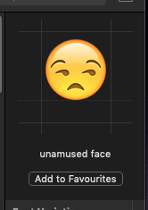
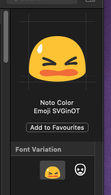
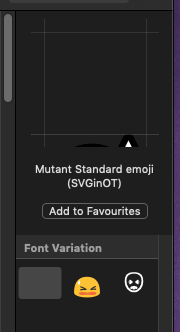
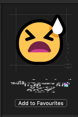

# SVGinOT metrics problems

Getting SVGinOT metrics to actually work.

 

----

#### ...and I found the problem!

---

## SVGinOT renderers don't like `viewbox` attributes.

SVGinOT renderers don't like the viewbox attribute and will render it incorrectly in a variety of ways (in macOS, it's by treating the coordinates of the viewbox as mapped onto font coordinates (whose Y-axis points in the reverse direction).

This problem (and the fix that I have used) is mentioned here:

- https://github.com/eosrei/emojione-color-font/issues/50#issuecomment-236987303

### How To Fix

- remove the `viewbox` attribute
- encapsulate all of the contents of `<svg>` in a `<g>`
- give that `<g>` a transform attribute with the following:
	- `translate(0, -(Em square vertical))`
	- `scale(Em square/viewbox square)`

	
In Mutant Standard's case, the `<g>` would be `<g transform="translate(0,-2048) scale(64)">`

now the metrics just need to be refined!